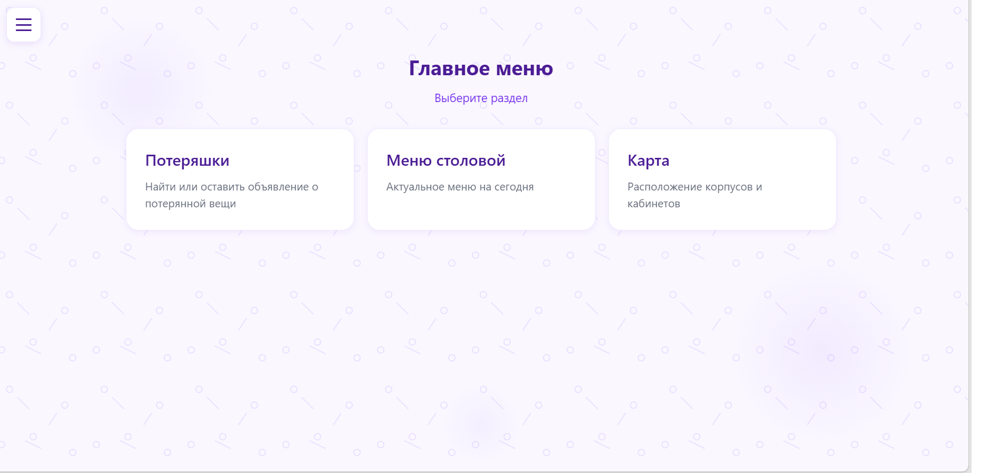
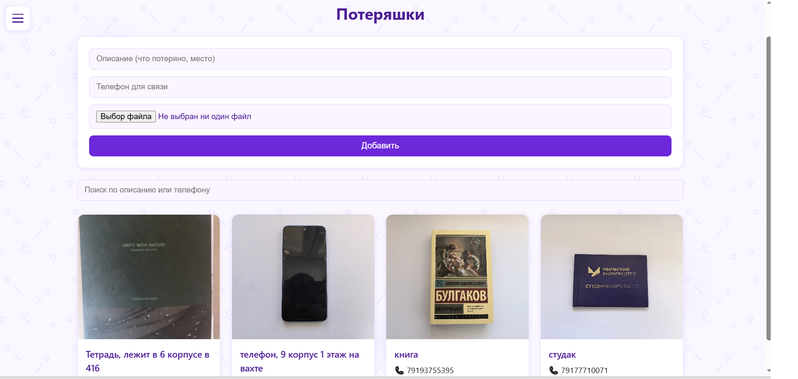
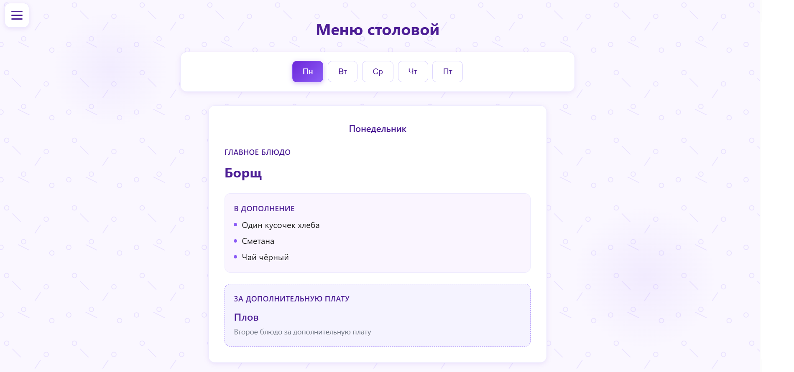
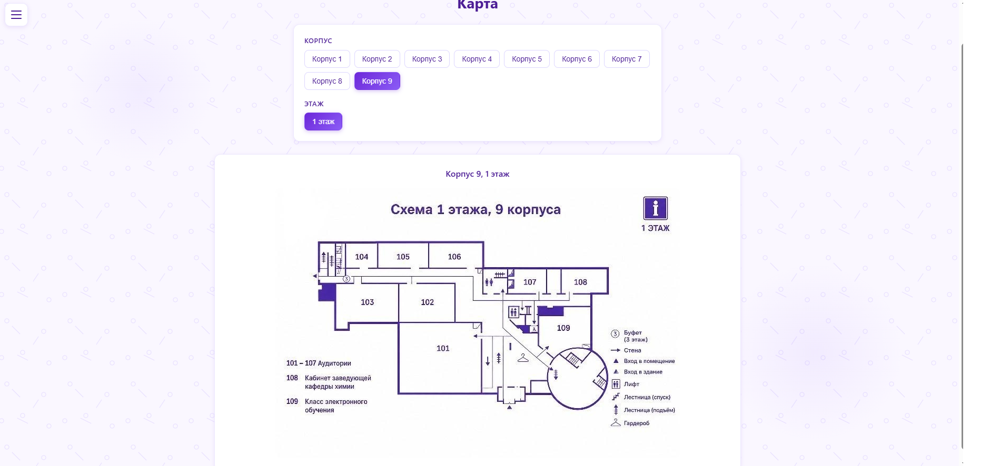

<h1>УУНиТ Помощник</h1>

Веб-приложение для студентов Уфимского университета науки и технологий. Помогает находить потерянные вещи, смотреть меню столовой и ориентироваться в корпусах.

<h2>Проблема</h2>

Студенты теряют вещи, не знают, что сегодня в столовой, и не могут найти нужный кабинет в незнакомом корпусе.

<h2>Решение</h2>

Единое веб-приложение с тремя разделами:

- <b>Потеряшки</b> — объявления о потерянных вещах с фото, телефоном и поиском.
- <b>Меню столовой</b> — актуальное меню по дням недели.
- <b>Карта</b> — схемы корпусов с выбором этажа.

<h2>Стек</h2>

Бэкенд:
- NestJS (Node.js)
- TypeORM
- MySQL
- Multer

Фронтенд:
- React + Vite
- React Router
- Axios

<h2>Скриншоты</h2>






<h2>Запуск</h2>

<h3>Бэкенд</h3>

```
cd project_it
npm i
npm run build
npm run start:prod
```

<h3>Фронтенд</h3>

```
cd frontend
npm i
npm run dev
```

<h2>Структура проекта</h2>

```

uust-helper/
├── project_it/     # бэкенд (NestJS + MySQL)
├── frontend/       # фронтенд (React + Vite)
└── README.md

```

<h2>Хакатон</h2>

ИТ-ФЕСТИВАЛЬ ТОП-ИТ, 
24.09.2026-01.10.2026

